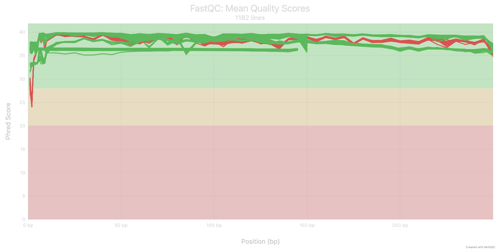
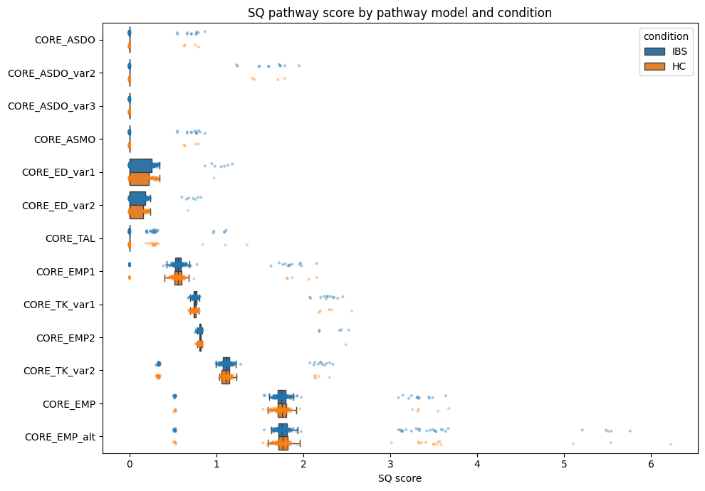
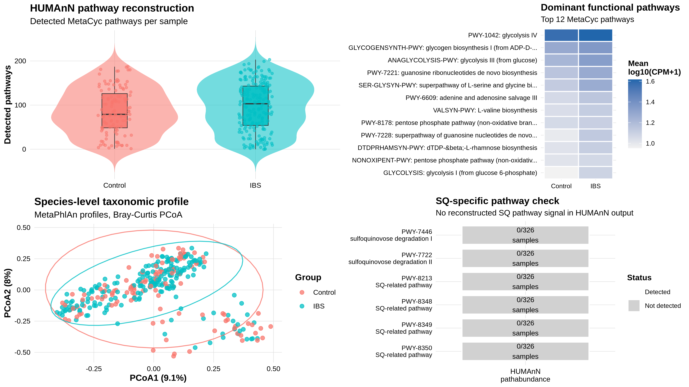
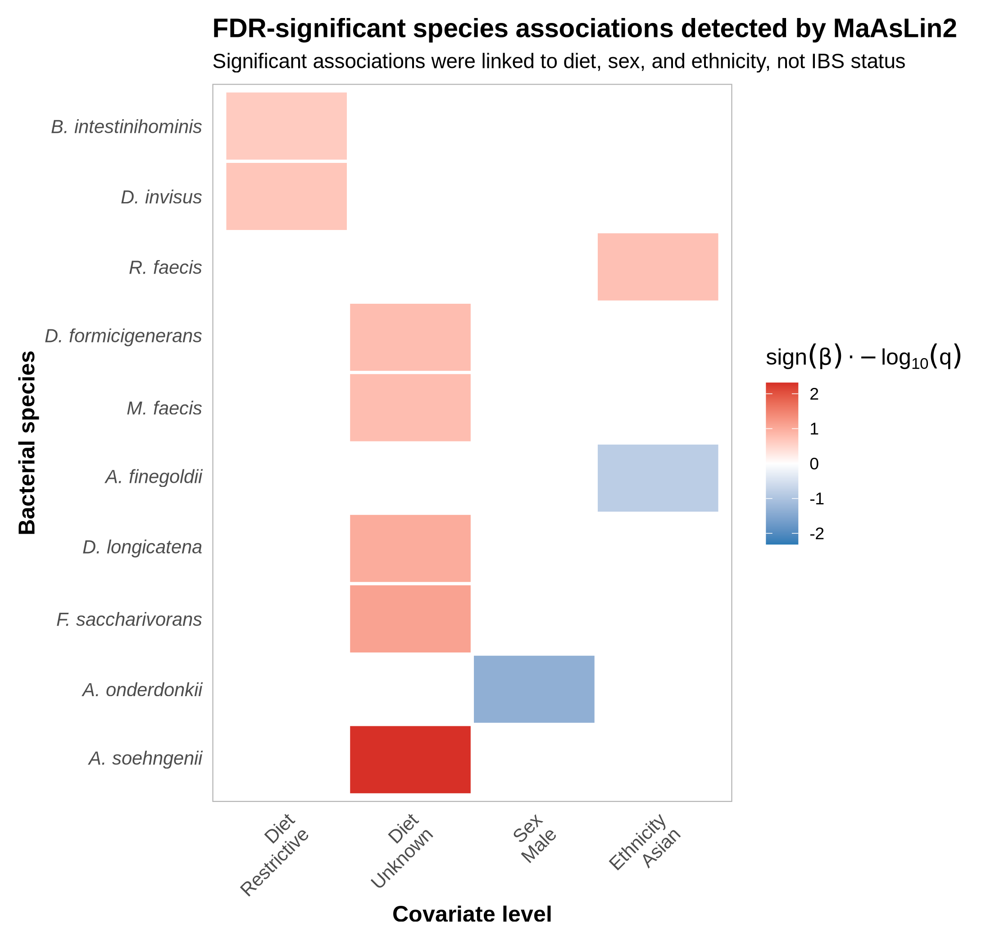
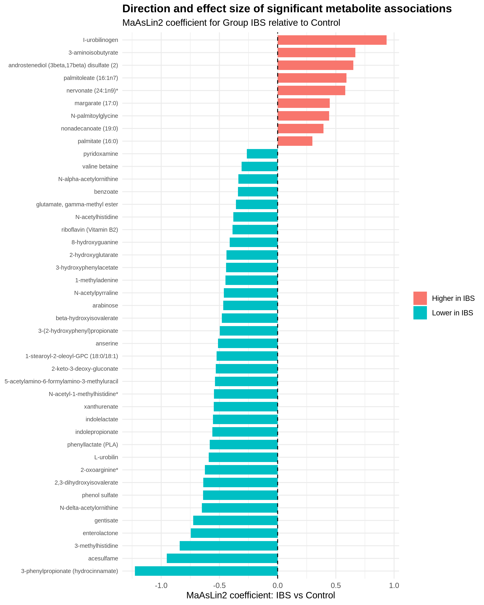
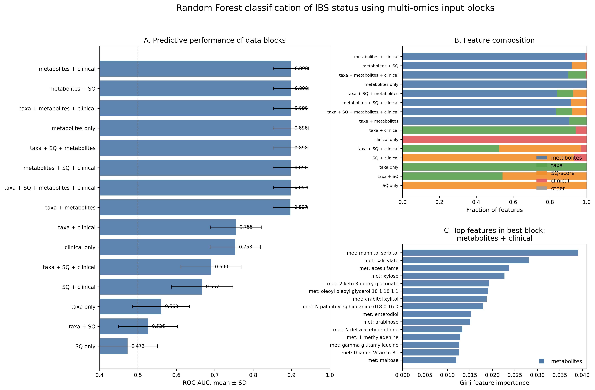
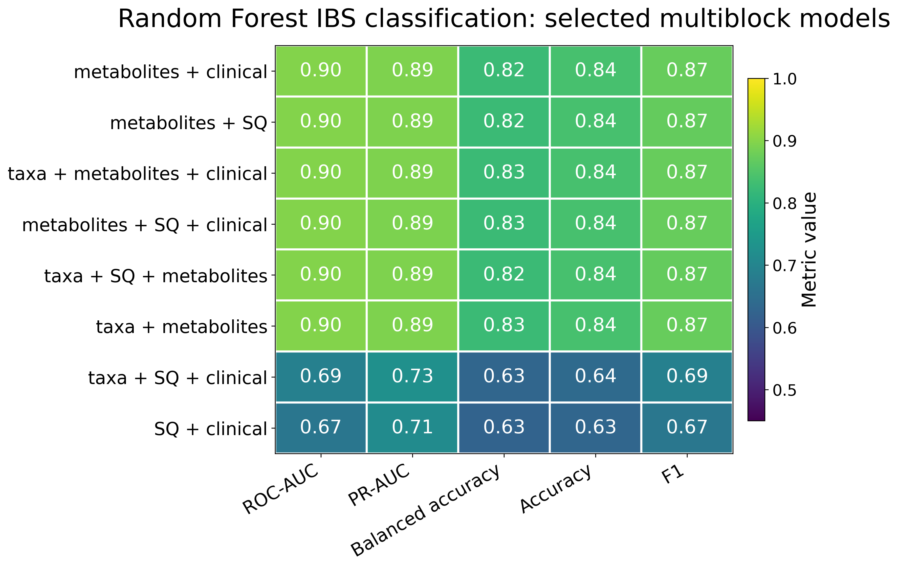

# Project report

## Sulfoquinovose metabolism in the IBS gut microbiome

This report describes the full analysis workflow used in the project: from public metatranscriptomic data download and preprocessing to taxonomic, functional, metabolomic, cross-omics, and Random Forest analyses.

The project focused on sulfoquinovose (SQ) metabolism in the gut microbiome and its possible relationship with irritable bowel syndrome (IBS).

---

## 1. Project rationale

Sulfoquinovose is a plant-derived sulfosugar found in sulfolipids of photosynthetic organisms. Several gut bacteria can degrade SQ through different metabolic pathways. Depending on the pathway and microbial community context, SQ degradation may contribute to different downstream products, including short-chain fatty acids or sulfur-containing compounds such as hydrogen sulfide.

The main biological question of this project was whether SQ-related microbial metabolism is detectable in public IBS gut microbiome data and whether SQ-related signals are associated with IBS status, IBS subtypes, sulfur-related metabolites, or classification performance.

---

## 2. Data sources

### 2.1 Metatranscriptomics

Metatranscriptomic sequencing data were obtained from NCBI Sequence Read Archive.

| Item | Value |
|---|---:|
| Source | NCBI SRA |
| BioProject | PRJNA812699 |
| Initial number of sequencing runs | 1184 |
| Main metatranscriptomic working cohort after preprocessing and metadata matching | 326 samples |
| IBS samples | 207 |
| Control samples | 119 |

The raw sequencing files are not stored in this repository because of their size. Download scripts are provided in `scripts/preprocessing/`.

### 2.2 Metabolomics

Untargeted fecal metabolomics data were obtained from the supplementary data of the same IBS multi-omics study.

| Item | Value |
|---|---:|
| Metabolomics cohort | 368 samples |
| IBS samples | 229 |
| Control samples | 139 |
| Metabolites used after processing | 601 |
| Matched metatranscriptomics-metabolomics subset used for multi-block Random Forest | 234 samples |
| IBS samples in matched subset | 128 |
| Control samples in matched subset | 106 |

The metabolomics layer was used both as an independent association analysis block and as one of the feature blocks in the multi-block Random Forest analysis.

---

## 3. Repository structure

```text
ibs-sq-metatranscriptomics/
├── data/
│   └── README.md
├── docs/
│   ├── methods.md
│   ├── workflow.md
│   ├── report.md
│   └── qc/
│       ├── README.md
│       └── SQ_data_multiqc_report.html
├── envs/
│   ├── ibs_env.yml
│   ├── humann_metaphlan_env.yml
│   ├── maaslin2_env.yml
│   ├── rf_py_env.yml
│   ├── diamond_sq_env.yml
│   └── software_versions.md
├── results/
│   ├── README.md
│   ├── figures/
│   └── tables/
└── scripts/
    ├── preprocessing/
    ├── profiling/
    ├── differential_abundance/
    ├── crossomics/
    ├── machine_learning/
    ├── visualization/
    └── targeted_sq/
```

Large raw sequencing files, full intermediate HUMAnN and MetaPhlAn outputs, and complete MaAsLin2 folders are not included in the repository. The repository contains selected scripts, final summary tables, final figures, documentation, and environment files.

---

## 4. Computational environment

The project was run on an HPC cluster using SLURM jobs and conda environments.

Main environments:

| Environment | Main purpose |
|---|---|
| `ibs_env` | SRA download, FASTQ conversion, KneadData preprocessing |
| `humann39_env_fix` | HUMAnN and MetaPhlAn profiling |
| `maaslin2_env` | MaAsLin2 association analyses and R plotting |
| `rf_py_env` | Random Forest modelling and Python visualization |
| `diamond_sq_env` | DIAMOND hit parsing, SQ-score calculation, statistical comparison |

The exported environment files are stored in `envs/`.

Software versions are summarized in:

```text
envs/software_versions.md
```

Important tools included:

- sra-tools 3.2.1
- KneadData 0.12.4
- Trimmomatic 0.40
- FastQC 0.12.1
- HUMAnN 3.9
- MetaPhlAn 4.1.1
- MaAsLin2 1.18.0
- Python 3.11.15
- scikit-learn 1.8.0
- MultiQC 1.35
- DIAMOND 2.2.0
- pandas 3.0.3
- NumPy 2.4.6
- SciPy 1.17.1
- matplotlib 3.10.9
- seaborn 0.13.2

---

## 5. Full analysis workflow

The analysis followed this main workflow:

```text
SRA metadata collection and FASTQ download
        ↓
Quality control, trimming, and host read removal with KneadData
        ↓
Targeted SQ-related gene search with DIAMOND
        ↓
DIAMOND hit filtering, enzyme-level aggregation, and SQ score calculation
        ↓
Taxonomic profiling with MetaPhlAn
        ↓
Functional profiling with HUMAnN
        ↓
HUMAnN table joining, normalization, and QC
        ↓
SQ pathway checks in HUMAnN / MetaCyc output
        ↓
Species-level and pathway-level association testing with MaAsLin2
        ↓
Metabolomics association testing with MaAsLin2
        ↓
Cross-omics association analysis of sulfur-related metabolites and taxa
        ↓
Random Forest multi-block classification
```

A shorter workflow summary is also provided in:

```text
docs/workflow.md
```

---

## 6. Data download

### 6.1 SRA download

The initial sequencing data were downloaded from NCBI SRA using `prefetch` and converted to FASTQ using `fasterq-dump`.

The download workflow included:

1. extraction of run identifiers from BioProject PRJNA812699;
2. download of `.sra` files with `prefetch`;
3. conversion to FASTQ with `fasterq-dump`;
4. compression with `pigz`;
5. continuation of interrupted downloads where needed.

Scripts:

```text
scripts/preprocessing/download_PRJNA812699.sbatch
scripts/preprocessing/download_PRJNA812699_fqd.sbatch
```

The initial dataset contained 1184 sequencing runs. Most runs were paired-end, with one single-end run.

---

## 7. Quality control and host read removal

### 7.1 KneadData preprocessing

Raw metatranscriptomic reads were processed with KneadData. The preprocessing included:

- quality trimming;
- removal of short reads;
- host read removal;
- FastQC quality reports.

KneadData internally used Trimmomatic and Bowtie2.

Main script:

```text
scripts/preprocessing/kneaddata_array.sh
```

Trimmomatic parameters:

```text
SLIDINGWINDOW:4:20
MINLEN:74
```

The trimming strategy required a minimum read length of 74 nucleotides. Adapter trimming presets were disabled using:

```text
--sequencer-source none
```

This was done after test FastQC reports indicated that adapter content was not a major issue.

### 7.2 Human read removal

Human contamination was removed by mapping reads against a human genome Bowtie2 database used by KneadData.

The human reference database was stored outside the repository because of its size.

### 7.3 MultiQC report

FastQC reports were aggregated with MultiQC.

The full interactive report is stored at:

```text
docs/qc/SQ_data_multiqc_report.html
```

A selected quality plot is stored at:

```text
results/figures/qc_fastqc_mean_quality_scores.png
```



**Figure 1.** MultiQC summary of FastQC mean per-base quality scores across preprocessed sequencing files. Most positions had high Phred quality scores, generally around 35-40, indicating overall good read quality after preprocessing.

The MultiQC report contains 1182 FastQC entries. This number reflects the files included in the aggregated FastQC output and is not identical to the number of biological samples used in downstream analysis.

---

## 8. Functional profiling with HUMAnN

Functional profiling was performed with HUMAnN.

Main script:

```text
scripts/profiling/humann_array.sh
```

HUMAnN produced three main output types per sample:

- `genefamilies.tsv`
- `pathabundance.tsv`
- `pathcoverage.tsv`

The per-sample tables were joined using `humann_join_tables`.

Joined tables included:

```text
genefamilies_all.tsv
pathabundance_all.tsv
pathcoverage_all.tsv
```

Abundance tables were normalized to CPM using `humann_renorm_table`. Coverage tables were not CPM-normalized because pathway coverage already represents pathway completeness rather than abundance.

For downstream analysis, both stratified and unstratified tables were considered:

- stratified tables retain taxon-level contributions;
- unstratified tables collapse each feature across taxa.

---

## 9. HUMAnN quality control

A dedicated QC step was performed on joined HUMAnN outputs.

The key metrics were:

- number of detected pathways per sample;
- `genefamilies_UNMAPPED`;
- `pathabundance_UNMAPPED`;
- `pathabundance_UNINTEGRATED`.

Definitions:

| Metric | Interpretation |
|---|---|
| `UNMAPPED` | signal that HUMAnN could not confidently assign to known features |
| `UNINTEGRATED` | functional signal detected at gene-family level but not integrated into complete MetaCyc pathways |
| detected pathways | number of reconstructed pathways per sample |

The final HUMAnN QC summary included 326 metatranscriptomic samples.

QC categories:

| QC category | Number of samples |
|---|---:|
| ok | 276 |
| borderline_low_pathways | 24 |
| hard_low_pathways | 14 |
| other QC-flagged samples | small number of additional samples with high UNMAPPED or UNINTEGRATED values |

The main QC conclusion was that the number of detected pathways was the most informative indicator of pathway-level sample quality. Samples with very low pathway reconstruction were treated cautiously and excluded from pathway-level association analysis where appropriate.

Selected QC tables exported to the repository:

```text
results/tables/sample_qc_summary.tsv
results/tables/sample_qc_flagged.tsv
```

---

## 10. SQ pathway checks in HUMAnN / MetaCyc output

A key project-specific step was to check whether known SQ degradation pathways were reconstructed by HUMAnN.

The following MetaCyc pathway IDs were checked:

```text
PWY-7446
PWY-7722
PWY-8213
PWY-8348
PWY-8349
PWY-8350
```

The search showed two different situations:

1. `PWY-7446` and `PWY-7722` were present in the internal HUMAnN / MetaCyc pathway database, but they were not reconstructed in the final HUMAnN output.
2. `PWY-8213`, `PWY-8348`, `PWY-8349`, and `PWY-8350` were not present in the internal pathway database used by the installed HUMAnN version, likely because they correspond to newer MetaCyc pathway definitions.

Supporting UniRef90 families for `PWY-7446` and `PWY-7722` were also checked against the joined HUMAnN gene-family table. Among 235 checked UniRef90 families, no exact matches were detected in the final unstratified HUMAnN gene-family table.

This result suggested that standard HUMAnN pathway reconstruction was not sufficient to capture SQ metabolism in this dataset. Therefore, the project also included a targeted SQ-related gene search strategy using DIAMOND and custom SQ reference information.

Selected exported table:

```text
results/tables/SQ_pathway_uniref90_hits.tsv
```

---

## 11. Targeted SQ-related gene search with DIAMOND

Because standard HUMAnN output did not reconstruct known SQ degradation pathways, a targeted read-level search was included as an additional SQ-focused analysis step.

The goal of this step was to detect SQ-related transcriptional signal more directly using a curated protein reference library and DIAMOND `blastx` search. The custom reference library included homologous proteins associated with several SQ degradation route models, including sulfo-EMP, SQ hydrolysis, sulfo-TAL, sulfo-TK, sulfo-ED, ASDO, and ASMO-related pathways.

### 11.1 DIAMOND hit parsing and filtering

Cleaned metatranscriptomic reads were aligned against the SQ-related protein reference library using DIAMOND `blastx`. The resulting DIAMOND hit tables were parsed and annotated using two additional sources of information:

- protein metadata extracted from the reference FASTA file;
- homolog annotation table linking reference accessions to SQ-related genes and pathway models.

For each DIAMOND hit, the following information was retained or derived:

- sample identifier;
- query read identifier;
- reference protein accession;
- homologous reference gene;
- SQ-related pathway assignment;
- percentage identity;
- bit score;
- alignment length;
- reference protein length;
- subject coverage.

Subject coverage was calculated as:

```text
subject_coverage = 100 × alignment_length_aa / protein_length_aa
```

Hits were filtered by percentage identity, bit score, alignment length, and subject coverage. When multiple hits were assigned to the same read, the best hit was retained based on bit score, sequence identity, and subject coverage. This reduced redundancy and prevented the same read from contributing multiple times to enzyme-level abundance estimates.

### 11.2 Enzyme-level aggregation and TPM-like normalization

Filtered DIAMOND hits were aggregated by sample and reference protein. For each sample and SQ-related enzyme, the number of uniquely assigned reads was counted.

Because reference proteins differed in length, enzyme-level read counts were normalized using a TPM-like approach:

```text
RPK_e = reads_e / protein_length_e(kb)

TPM_e = 10^6 × RPK_e / sum(RPK_all)
```

Here, `reads_e` is the number of reads assigned to enzyme `e`, and `protein_length_e(kb)` is the reference protein length in kilobases. This normalization was used to make enzyme-level signals more comparable across reference proteins within each sample.

### 11.3 Core SQ pathway models used for SQ score calculation

For each SQ pathway model, a targeted SQ score was calculated using predefined core enzymatic steps. Each item in brackets corresponds to one pathway step. Alternative genes within the same step were treated using OR logic; therefore, detection of any listed alternative enzyme was considered support for that step. When several alternative enzymes were detected for the same step, the maximum TPM value was used.

| Pathway model | Core enzymatic steps used for scoring |
|---|---|
| `CORE_EMP1` | `yihV`, `yihT`, `yihS`, `yihQ` |
| `CORE_EMP2` | `sqiA`, `sqiK`, `sqvD`, `sqgA` |
| `CORE_EMP` | `(yihV or sqiK)`, `(yihT or sqiA)`, `(yihS or sqvD)`, `(yihQ or sqgA)`, `(yihU or slaB)` |
| `CORE_EMP_alt` | `(yihV or sqiK)`, `(yihT or sqiA)`, `(yihS or sqvD)`, `(yihQ or sqgA)`, `(sqvB or yihR)` |
| `CORE_TAL` | `sqvA`, `(yihS or sqvD)`, `(yihQ or sqgA)`, `(sqvB or yihR)`, `(yihU or slaB)` |
| `CORE_TK_var1` | `sqwGH`, `sqwI`, `(yihS or sqvD)`, `(yihQ or sqgA)` |
| `CORE_TK_var2` | `sqwGH`, `sqwI`, `(yihS or sqvD)`, `(yihQ or sqgA)`, `sqwF`, `sqwD` |
| `CORE_ED_var1` | `sedA`, `sedB`, `sedC`, `sedD`, `(yihQ or sqgA)` |
| `CORE_ED_var2` | `sedA`, `sedB`, `sedC`, `sedD`, `(yihQ or sqgA)`, `(yihU or slaB)` |
| `CORE_ASDO` | `squD`, `(yihQ or sqgA)`, `squF` |
| `CORE_ASDO_var2` | `squD`, `(yihQ or sqgA)` |
| `CORE_ASDO_var3` | `squD`, `squF` |
| `CORE_ASMO` | `sqoD`, `(yihQ or sqgA)`, `squF` |

For EMP-related models, `(yihV or sqiK)` and `(yihT or sqiA)` were treated as key defining steps because they represent the kinase and aldolase components of the sulfo-EMP route.

### 11.4 SQ score calculation

For each sample and pathway model, SQ score was calculated from TPM-like enzyme-level values and core step coverage.

```text
score_raw = mean(log1p(TPM_e) for core pathway steps)

coverage = detected_core_steps / total_core_steps

SQ_score = score_raw × coverage
```

The `score_raw` component reflects the average abundance of enzymes supporting the pathway model, while `coverage` penalizes incomplete detection of core enzymatic steps. Therefore, a pathway model receives a higher SQ score only when it has both detectable enzyme-level abundance and broader core-step support.

The resulting SQ score should be interpreted as a targeted read-level proxy for SQ-related transcriptional signal. It does not prove complete pathway reconstruction and should not be interpreted as direct biochemical evidence of SQ degradation.

### 11.5 SQ score results and IBS/control comparison

The final SQ score table contained 326 metatranscriptomic samples and 13 SQ pathway models. Each row represented one sample and one pathway model.

Selected output tables here:

```text
results/tables/targeted_sq/sq_scores.tsv
results/tables/targeted_sq/sq_score_ibs_hc_stats.tsv
```

The strongest SQ-score signals were observed for EMP- and TK-related models, especially `CORE_EMP`, `CORE_EMP_alt`, `CORE_TK_var1`, and `CORE_TK_var2`. Several other models, such as `CORE_ASDO`, `CORE_ASMO`, `CORE_TAL`, and ED-related variants, showed lower or more sparse scores across samples.

IBS and control groups were compared for each pathway model using the Mann-Whitney U test with Benjamini-Hochberg FDR correction. No SQ pathway model showed a statistically significant IBS/control difference after FDR correction. The lowest nominal p-values were observed for TK-related models, but these associations did not remain significant after multiple testing correction.

The main SQ-score figure is shown below.



**Figure 2.** Targeted SQ pathway scores in IBS and control metatranscriptomic samples. Each point represents one sample, and boxplots summarize the distribution of SQ scores for each pathway model. SQ scores were calculated from DIAMOND-derived enzyme-level signals using TPM-like normalization and core-step coverage.

This result suggests that SQ-related transcriptional signal was detectable at the targeted enzyme-search level, but SQ scores alone did not show robust separation between IBS and control samples.

### 11.6 SQ score and metabolite correlation analysis

To connect targeted SQ scores with the metabolomics layer, Spearman correlation analysis was performed between SQ pathway scores and metabolite abundances in the matched metatranscriptomics-metabolomics subset.

The correlation analysis included:

- 13 SQ pathway models;
- 601 metabolites;
- 193 matched samples with available SQ-score and metabolomics data;
- 7813 pathway-metabolite correlation tests.

Selected output tables:

```text
results/tables/targeted_sq/metabolite_correlations/sq_score_metabolite_spearman_correlations.tsv
results/tables/targeted_sq/metabolite_correlations/sq_score_metabolite_spearman_rho_matrix.tsv
results/tables/targeted_sq/metabolite_correlations/sq_score_metabolite_q_value_matrix.tsv
```

Several SQ score-metabolite correlations were nominally significant, and a subset remained significant after FDR correction. The strongest correlations were moderate in magnitude, indicating metabolite co-variation with SQ-score features rather than direct pathway-level causality.

Selected correlation heatmaps:


**Figure 3.** Significant Spearman correlations between targeted SQ pathway scores and metabolite abundances after FDR correction.

These correlations were used as exploratory evidence to connect targeted SQ-related transcriptional features with the metabolomics layer.

The resulting SQ-score table was transformed into a wide feature matrix for downstream modelling. The final SQ feature block contained 57 SQ-related features, including summary features and pathway-specific scores:

```text
sq__SQ_score_max
sq__SQ_score_mean
sq__coverage_max
sq__coverage_mean
sq__n_models_with_detected_steps
sq__SQ_score__CORE_ASDO
sq__SQ_score__CORE_EMP1
sq__coverage__CORE_EMP1
sq__n_detected_steps__CORE_EMP1
sq__score_raw__CORE_EMP1
```

The DIAMOND/SQ-score block was then used as one of the feature groups in the Random Forest multi-block classification analysis.

---

## 12. Taxonomic profiling with MetaPhlAn

Taxonomic profiling was performed with MetaPhlAn.

Main scripts:

```text
scripts/profiling/prepare_metaphlan_samples.sh
scripts/profiling/metaphlan_array.sh
```

The main species-level matrix used for downstream analysis was:

```text
results/metaphlan_metatranscriptome/joined/species_sample_matrix_with_groups.tsv
```

This file contained species-level abundance profiles for the metatranscriptomic cohort.

After processing and merging duplicated species labels, 626 unique species-level taxa were obtained.

The final working group composition was:

| Group | Samples |
|---|---:|
| IBS | 207 |
| Control | 119 |

### 12.1 Descriptive species analysis

The descriptive species analysis included:

- mean abundance by group;
- median abundance by group;
- prevalence by group;
- log2 fold-change between IBS and Control;
- alpha diversity;
- beta diversity using PCoA based on Bray-Curtis distance.

Selected output figures:

```text
results/figures/alpha_diversity_shannon_boxplot.pdf
results/figures/pcoa_bray_curtis_ibs_control.pdf
```

Selected output tables:

```text
results/tables/species_ibs_control_maaslin2_significant_results.tsv
results/tables/species_subtypes_phenotype_group_significant_results.tsv
```

The descriptive comparison suggested that several anaerobic gut bacteria differed between IBS and Control groups. These descriptive differences were then evaluated more formally with MaAsLin2.

---

## 13. Functional pathway overview

A baseline overview of HUMAnN pathways was performed before formal association testing.

The top pathways were dominated by central microbial metabolic functions, including:

- glycolysis;
- nucleotide biosynthesis;
- pentose phosphate pathway;
- amino acid biosynthesis;
- glycogen metabolism.

This was expected because highly abundant pathways in metatranscriptomic data often correspond to core housekeeping microbial functions.

A combined functional and taxonomic profile figure was exported as:

```text
results/figures/fig7_combined_functional_taxonomic_profile.png
```



**Figure 4.** Combined overview of selected functional and taxonomic features from the metatranscriptomic analysis.

---

## 14. MaAsLin2 association analyses

MaAsLin2 was used for covariate-adjusted association testing.

General modelling strategy:

- method: linear model;
- sequencing data normalization: TSS;
- sequencing data transformation: LOG;
- multiple testing correction: Benjamini-Hochberg FDR;
- significance threshold: q-value <= 0.25.

### 14.1 Pathway-level MaAsLin2

Pathway-level association testing was performed using unstratified HUMAnN pathabundance features.

Preparation scripts:

```text
scripts/differential_abundance/make_metadata_for_maaslin2.R
scripts/differential_abundance/make_pathabundance_for_maaslin2.R
```

Run script:

```text
scripts/differential_abundance/run_maaslin2_pathways.R
```

Input after QC filtering:

| Item | Value |
|---|---:|
| Samples | 311 |
| Control | 114 |
| IBS | 197 |
| Initial pathway features | 300 |
| Features retained after prevalence filtering | 185 |

Model:

```text
expression ~ ibs_status + age + sex + bmi
```

Main result:

No pathway-level associations with IBS status passed FDR correction at q <= 0.25 in this model.

Exported selected table:

```text
results/tables/humann_pathways_maaslin2_significant_results.tsv
```

### 14.2 Species-level MaAsLin2

Species-level association testing was performed using MetaPhlAn species abundance profiles.

Preparation script:

```text
scripts/differential_abundance/make_metaphlan_species_for_maaslin2.R
```

Run scripts:

```text
scripts/differential_abundance/run_maaslin2_species.R
scripts/differential_abundance/run_maaslin2_species_subtypes.R
```

The species-level models included IBS status and relevant covariates such as age, sex, BMI, diet, and ethnicity where available.

Selected exported outputs:

```text
results/tables/species_ibs_control_maaslin2_significant_results.tsv
results/tables/species_subtypes_phenotype_group_significant_results.tsv
results/figures/maaslin2_species_covariates_heatmap.png
```



**Figure 5.** Heatmap-style summary of selected MaAsLin2 species-level associations and covariate effects.

Species-level results were more informative than pathway-level results. Several taxonomic features showed associations or nominal differences between IBS-related groups, supporting the idea that taxonomic shifts may be more detectable in this dataset than broad HUMAnN pathway-level changes.

---

## 15. Metabolomics association analysis

Metabolomics analysis was performed using the fecal metabolomics data associated with the same IBS multi-omics study.

Input files on the working HPC project included:

```text
data/metabolomics/raw/metabolite_abundance_368.csv
data/metabolomics/raw/metadata_metabolomics_368.csv
data/metabolomics/raw/metadata_metatranscriptomics_327.csv
```

After matching metabolite abundance data and metadata:

| Item | Value |
|---|---:|
| Samples | 368 |
| Metabolites | 601 |
| Control | 139 |
| IBS | 229 |

Preparation and analysis scripts:

```text
scripts/differential_abundance/make_metabolomics_for_maaslin2.R
scripts/differential_abundance/make_metadata_for_maaslin2.R
scripts/differential_abundance/run_maaslin2_metabolomics.R
scripts/differential_abundance/run_maaslin2_metabolomics_with_HAD.R
```

The model included IBS/control status and covariates such as:

- age;
- sex;
- BMI;
- race;
- diet category;
- metabolomics batch;
- HAD-Anxiety where used.

Selected exported table:

```text
results/tables/metabolomics_group_IBS_q025_results.tsv
```

Selected exported figures:

```text
results/figures/metabolomics_significant_metabolites_coefficients.png
results/figures/sulfur_related_metabolites_boxplots.png
results/figures/phenol_sulfate_q025_barplot.pdf
```



**Figure 6.** Selected metabolite associations with IBS status from MaAsLin2 analysis.

A sulfur-related metabolite subset was inspected separately. This was important because the biological hypothesis of the project involved SQ degradation and sulfur-associated metabolic outputs.

---

## 16. Cross-omics analysis

Cross-omics analysis was performed to connect sulfur-related metabolites with species-level taxonomic profiles.

The goal was to test whether sulfur-associated metabolites were linked to specific bacterial species, especially taxa that may contribute to sulfur metabolism or SQ-related metabolism.

Scripts:

```text
scripts/crossomics/run_maaslin2_species_vs_sulfur_metabolites.R
scripts/crossomics/plot_crossomics_sulfur_metabolites_summary.R
```

Selected exported tables:

```text
results/tables/crossomics_sulfur_q025_results_combined.tsv
results/tables/crossomics_phenol_sulfate_q025_taxa_results.tsv
```

Selected exported figures:

```text
results/figures/crossomics_sulfur_q025_barplot.pdf
results/figures/phenol_sulfate_q025_barplot.pdf
```

The cross-omics analysis was exploratory. It was used to identify candidate taxa-metabolite relationships rather than to make causal claims.

---

## 17. Random Forest multi-block classification

A multi-block Random Forest analysis was performed to compare how different feature groups contribute to IBS/control classification.

The main reason for this analysis was to compare predictive signal across:

- clinical variables;
- SQ-score features;
- taxonomic features;
- metabolomic features;
- combinations of these blocks.

### 17.1 Matched sample set

To compare feature blocks fairly, the Random Forest analysis used only samples that had the required matched data layers.

Final matched subset:

| Item | Value |
|---|---:|
| Samples | 234 |
| IBS | 128 |
| Control | 106 |

This subset was smaller than the full metatranscriptomic cohort because metabolomics data were available only for a subset of metatranscriptomic samples.

### 17.2 Feature blocks

The main metadata backbone was:

```text
metadata/metadata_326_clean_v2.tsv
```

The SQ-score data were transformed into wide format and produced 57 SQ-related features.

The MetaPhlAn taxonomic block was filtered by prevalence. Before filtering, 626 species-level taxa were considered. After keeping taxa detected in at least 10% of samples, 63 taxa were retained.

The metabolomics block contained 601 metabolite features.

Input block generation script:

```text
scripts/machine_learning/make_rf_multiblock_input.R
```

Random Forest run script:

```text
scripts/machine_learning/run_rf_multiblock_ibs.py
```

SLURM script:

```text
scripts/machine_learning/run_rf_multiblock_ibs.slurm
```

Plotting scripts:

```text
scripts/machine_learning/plot_rf_multiblock_results.py
scripts/machine_learning/plot_rf_metrics_heatmap_selected.py
```

Selected exported outputs:

```text
results/tables/random_forest_block_summary.tsv
results/figures/random_forest_final_summary.png
results/figures/random_forest_metrics_heatmap_selected_blocks.png
```



**Figure 7.** Summary of Random Forest multi-block IBS/control classification analysis.



**Figure 8.** Random Forest performance metrics across selected feature blocks.

The Random Forest analysis was used as an exploratory comparison of feature blocks. It should not be interpreted as a validated diagnostic model. The main value of this step was to compare which data layers carried classification signal and whether SQ-related features added information when combined with taxa, metabolites, or clinical variables.

---

## 18. Selected final outputs

### 18.1 Result tables

Selected final tables stored in the repository:

```text
results/tables/SQ_pathway_uniref90_hits.tsv
results/tables/sample_qc_summary.tsv
results/tables/sample_qc_flagged.tsv
results/tables/humann_pathways_maaslin2_significant_results.tsv
results/tables/species_ibs_control_maaslin2_significant_results.tsv
results/tables/species_subtypes_phenotype_group_significant_results.tsv
results/tables/metabolomics_group_IBS_q025_results.tsv
results/tables/crossomics_sulfur_q025_results_combined.tsv
results/tables/crossomics_phenol_sulfate_q025_taxa_results.tsv
results/tables/random_forest_block_summary.tsv
```

### 18.2 Figures

Selected final figures stored in the repository:

```text
results/figures/qc_fastqc_mean_quality_scores.png
results/figures/alpha_diversity_shannon_boxplot.pdf
results/figures/pcoa_bray_curtis_ibs_control.pdf
results/figures/fig7_combined_functional_taxonomic_profile.png
results/figures/maaslin2_species_covariates_heatmap.png
results/figures/metabolomics_significant_metabolites_coefficients.png
results/figures/sulfur_related_metabolites_boxplots.png
results/figures/crossomics_sulfur_q025_barplot.pdf
results/figures/phenol_sulfate_q025_barplot.pdf
results/figures/random_forest_final_summary.png
results/figures/random_forest_metrics_heatmap_selected_blocks.png
```

---

## 19. Main findings

### 19.1 Data processing and QC

The public metatranscriptomic dataset was successfully downloaded, preprocessed, and profiled. After preprocessing and metadata matching, the main metatranscriptomic working cohort contained 326 samples.

The HUMAnN output was heterogeneous at the pathway reconstruction level. Most samples were usable, but a subset had very low pathway counts or elevated UNMAPPED/UNINTEGRATED values. This justified QC-aware filtering for pathway-level association testing.

### 19.2 SQ metabolism was not recovered as complete HUMAnN pathways

Known SQ MetaCyc pathways were not reconstructed in the final HUMAnN pathabundance or pathcoverage tables. For the two SQ pathways present in the internal HUMAnN database, exact supporting UniRef90 families were also not detected in the joined unstratified gene-family table.

This indicates that standard pathway-level HUMAnN reconstruction did not capture SQ degradation in this dataset.

### 19.3 Targeted SQ gene search was therefore necessary

Because HUMAnN pathway reconstruction did not recover SQ pathways, the project used a targeted SQ-related DIAMOND/SQ-score strategy. This made it possible to represent SQ-related information as a separate feature block for downstream analysis.

### 19.4 Taxonomic and metabolomic signals were more informative than broad pathway-level signals

Pathway-level MaAsLin2 analysis did not identify significant IBS-associated pathways after FDR correction. In contrast, species-level and metabolomics analyses provided more interpretable candidate associations.

### 19.5 Sulfur-related metabolites are relevant to the project hypothesis

Sulfur-associated metabolites, including phenol sulfate and other sulfate-related compounds, were investigated as a focused metabolomics subset. This connected the SQ hypothesis with measured metabolite differences in the IBS dataset.

### 19.6 Random Forest provided an integrative comparison of data layers

The Random Forest analysis compared clinical, taxonomic, SQ-score, metabolomic, and combined feature blocks on the same matched 234-sample subset. This provided an exploratory view of the relative classification signal carried by each omics layer and their combinations.

---

## 20. Limitations

Several limitations should be considered.

1. The study is based on public cross-sectional data. Therefore, associations cannot be interpreted as causal.
2. The SQ pathway signal was not reconstructed by standard HUMAnN pathway analysis, so SQ interpretation relies on targeted gene-level and SQ-score approaches.
3. Metabolomics data were available only for a subset of metatranscriptomic samples, reducing the sample size for integrative analyses.
4. Batch effects, diet, IBS subtype, and psychological covariates may influence microbial and metabolomic profiles.
5. Random Forest models were used for exploratory comparison of feature blocks, not as clinically validated diagnostic classifiers.
6. Direct hydrogen sulfide measurements were not available, so sulfur-metabolism interpretation is indirect.

---

## 21. Reproducibility notes

The scripts in this repository reflect the original HPC execution environment. Some scripts contain absolute paths from the working cluster directory:

```text
/home/alina_tgrv/beegfs/IBS_SQ
```

To reproduce the analysis on another system, users should update:

- `BASE`
- `base_dir`
- `PROJECT_DIR`
- input paths
- output paths
- conda environment paths
- SLURM parameters

The repository intentionally does not include large raw data or full intermediate outputs.

Raw sequencing data should be downloaded from NCBI SRA using the scripts in:

```text
scripts/preprocessing/
```

Environment files are provided in:

```text
envs/
```

Selected final tables and figures are provided in:

```text
results/tables/
results/figures/
```

---

## 22. Conclusions

This project built a complete analysis workflow for studying SQ-related microbial metabolism in an IBS gut microbiome dataset.

The main outcome is that standard HUMAnN pathway reconstruction did not detect complete SQ degradation pathways in the cohort, even though some SQ pathway definitions were present in the internal MetaCyc database used by HUMAnN. This made a targeted DIAMOND/SQ-score approach necessary.

The project then integrated several data layers: metatranscriptomic taxonomy, HUMAnN functional profiles, targeted SQ features, metabolomics, sulfur-related metabolite associations, and multi-block Random Forest classification.

Overall, the results support the idea that SQ-related metabolism should be investigated at a targeted gene or protein-search level rather than relying only on broad pathway reconstruction. The most promising next steps are to refine the SQ gene reference, validate DIAMOND-derived SQ features, and test whether SQ-related microbial signatures are reproducibly associated with IBS phenotypes or sulfur-related metabolite profiles in independent cohorts.

---

## 23. References

1. IBS multi-omics source study and dataset:  
   https://link.springer.com/article/10.1186/s40168-022-01450-5

2. NCBI BioProject PRJNA812699:  
   https://www.ncbi.nlm.nih.gov/bioproject/PRJNA812699

3. Hanson BT et al. Sulfoquinovose is a select nutrient of prominent bacteria and a source of hydrogen sulfide in the human gut.  
   https://pubmed.ncbi.nlm.nih.gov/33790426/

4. Wei Y, Tong Y, Zhang Y. New mechanisms for bacterial degradation of sulfoquinovose.  
   https://portlandpress.com/bioscirep/article/42/10/BSR20220314/231898/New-mechanisms-for-bacterial-degradation-of

5. Sulfoquinovose is exclusively metabolized by the gut microbiota and degraded differently in mice and humans:  
   https://link.springer.com/article/10.1186/s40168-025-02175-x

6. HUMAnN documentation:  
   https://huttenhower.sph.harvard.edu/humann/

7. MetaPhlAn documentation:  
   https://huttenhower.sph.harvard.edu/metaphlan/

8. MaAsLin2 documentation:  
   https://huttenhower.sph.harvard.edu/maaslin/

9. Buchfink B, Reuter K, Drost H-G. Sensitive protein alignments at tree-of-life scale using DIAMOND.  
   https://www.nature.com/articles/s41592-021-01101-x
